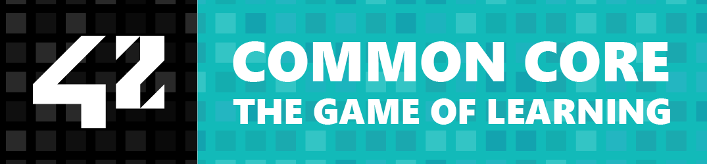

# 42-common Core (1337)

Detailed documentation of my 42 Porto Common Core projects and exams, during Common Core.

## PROJECTS

| Project                                                    | Language                                                                        | Grade                                                             |  Evaluation Information |
| :--------------------------------------------------------- | :------------------------------------------------------------------------------ | :---------------------------------------------------------------- |  :--------------------- |
| [libft](https://github.com/mirr-x/42-libft)                |          |  |  `3 peers` `15 mins`    |
| [ft_printf](https://github.com/mirr-x/42-ft_printf)         |      |  |  `3 peers` `15 mins`    |
<!-- | [get_next_line]() 										 |  |  |  `3 peers` `15 mins`    |
| [born2beroot](https://github.com/mirr-x/42-born2beroot)     |    |  |  `3 peers` `1 hour`     |
| [minitalk](https://github.com/mirr-x/42-minitalk)           |       |  |  `3 peers` `15 mins`    |
| [so_long](https://github.com/mirr-x/42-so_long)             |        |  |  `3 peers` `15 mins`    |
| [push_swap](https://github.com/mirr-x/42-push_swap)         |      |   |  `3 peers` `15 mins`    |
| [philosophers](https://github.com/mirr-x/42-philosophers)   |   |   |  `3 peers` `15 mins`    |
| [minishell](https://github.com/mirr-x/42-minishell)         |      |   |  `3 peers` `15 mins`    |
| [net_practice](https://github.com/mirr-x/42-net_practice)   |   |   |  `3 peers` `15 mins`    |
| [cub3d](https://github.com/mirr-x/42-cub3d)                 |          |         |  `3 peers` `45 mins`    |
| [cpp_modules](https://github.com/mirr-x/42-cpp_modules)     |    |         |  `2 peers` `15 mins`    |
| [inception](https://github.com/mirr-x/42-inception)         |      |         |  `3 peers` `30 mins`    |
| webserv                                                    |                       |         |  `3 peers` `1 hour`     |
| ft_transcendence                                           |                       |         |  `3 peers` `1 hour`     | -->

> [!NOTE]
> In 42, the following projects are a personal choice:
>   `so_long`, `fract-ol` or `fdf` > `minitalk` or `pipex` > `cub3d` or `minirt` > `webserv` or `ft_irc`
